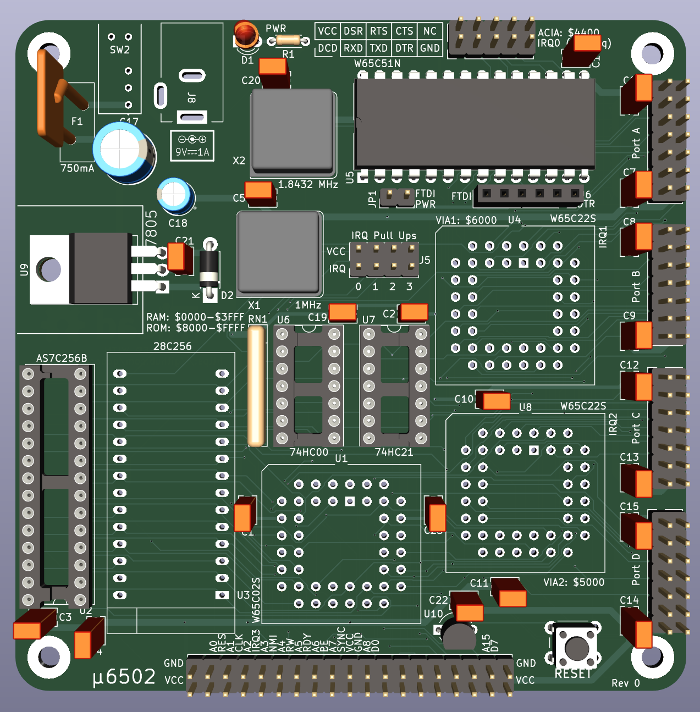

# u6502 - Single Board Computer
Very basic 6502 SBC based on the [design](http://wilsonminesco.com/6502primer/potpourri.html#BAS_CPU) by Garth Wilson.

## Project Status
A rev 0 board has been fabricated and assembled. Testing is in progress.

### Known Issues
- **LCD Display** - The LCD display correctly shows the two lines that are expected at power up but only displays a single line after a reset. Assumed to be a software issue involving the initialization logic for the LCD controller.
- **ACIA** - No TX traffic is observed from the ACIA. Currently unable to determine the reason. A logic analyzer connected to the chip select and register select signals for the ACIA _seem_ to indicate that the chip is being addressed correctly.

## Design Goals & Project Objectives

- Keep it _almost_ as simple as possible.
    - Start with a proven design to reduce the likelihood of errors.
    - Keep PCB size to less than 100mm^2 to minimize fabrication cost.
    - Use only parts that are currently in production and favor through hole components where possible.
- Support TTL RS232 UART with RTS/CTS flow control.
    - Allow for the loading of programs to memory from serial.
- Support PS2 protocol for keyboard through VIA.
- Support 16 x 2 character LCD display through VIA.
    - (Optional) Support larger character or graphics LCD display.
- (Optional) Support >4 MHz CPU speed.

## Repository Structure

- [boards](./boards/) - Kicad projects containing schematics and layout files for the SBC and any ancillary support devices.
- [docs](./docs/) - Documentation and static assests for the current iteration of the u6502.
- [firmware](./firmware/) - 6502 assembly files and build tooling (cc65) to produce ROMs for the u6502.
- [tools](./tools/) - Software utilities and Arduino sketches used to support the testing and development of the u6502.

## Addres Map

- RAM $0000:3FFF
- ACIA $4400:4403
- VIA2 $5000:500F
- VIA1 $6000:600F
- ROM $8000:FFFF

## Parts Selection

- CPU - W65C02S (PLCC) WDC current production 65C02
- Memory - AS7C256B-15PIN (DIP) SRAM chosen for package size more than speed
- ROM - Any 28C256 JEDEC compatible EEPROM (DIP) 
- Address Decoding - 74HC00 (DIP)
- IRQ Control - 74HC21 (DIP)
- GPIO - 2 W65C22S VIAs (PLCC)
- Serial IO - W65C51N ACIA (DIP)
- Power Regulation - LM7805 (TO220) compatible linear regulator
- Oscillators - 1MHz CPU clock & 1.8432 MHz for baud clock generation
- Reset control - DS1813 (TO92)